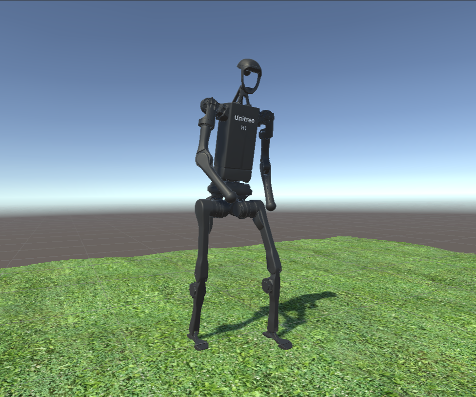
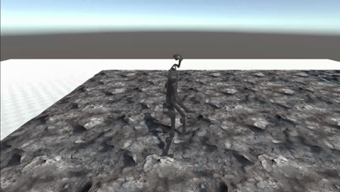

# Vision-enhanced-Adaptive-Gait-Control

This repository contains the implementation of a deep reinforcement learning framework for vision-based adaptive gait control of a humanoid robot (Unitree H1) in complex terrains(currently includes `ice surface`, `grassland`, normal `woodfloor` and `rock road`). This project was developed as part of the MSc in Human and Biological Robotics at Imperial College London.


*A trained agent navigating varied terrain in the [Unity/MuJoCo](https://mujoco.readthedocs.io/en/stable/unity.html#unity-plug-in) simulation environment. This result is preliminary, and I am currently further fine-tuning the gait policy.*

---

## Overview

Traditional robot gait controllers primarily rely on proprioceptive feedback (e.g., joint angles and velocities). This forces them to react *passively* to new terrains only after making contact, which increases the risk of falling. The core objective of this project is to equip a humanoid robot with **proactive foresight**.

By introducing an innovative **dual-stream vision module**, the robot can actively "see" and understand complex upcoming terrains like stairs, slopes, or slippery surfaces. This visual information is fused with proprioceptive data and fed into a policy network trained with **PPO (Proximal Policy Optimization)**. The final system enables the agent to learn a stable and human-like gait that proactively adapts to dynamic terrain changes in a high-fidelity physics simulation.

## Key Features

- **Dual-Stream Vision Module**: Processes both **geometric** (via a heightmap CNN) and **semantic** (via a terrain classification network) information for a comprehensive understanding of the environment.
- **Imitation Learning Baseline**: A robust and natural walking policy is pre-trained by imitating human motion capture data, providing a high-quality starting point for learning.
- **PPO for Policy Optimization**: The gait policy is fine-tuned end-to-end using Proximal Policy Optimization to handle dynamic and challenging environments.
- **High-Fidelity Simulation**: Built with **Unity** (for visual rendering) and **MuJoCo** (for physics simulation) to ensure realistic and reliable training dynamics.

## Technical Architecture(Figures to be completed)

 
1.  **Perception**:
    - **Proprioceptive State**: Joint angles, velocities, and root information (520-dim).
    - **Geometric Vision**: A 32x32 heightmap of the terrain ahead is processed by a 3-layer CNN to produce a 64-dim feature vector.
    - **Semantic Vision**: An RGB image of the terrain is processed by a MobileNetV3 classifier to produce a 8-dim logits vector.

2.  **Decision**:
    - The three feature streams are **fused** into a 592-dim state vector.
    - This state vector is fed into a **PPO policy network** (3-layer MLP) to make a decision.

3.  **Control**:
    - The policy network outputs 19-dimensional **PD controller target angles** to actuate the robot's joints.

## Setup and Installation

This project is built directly within the Unity Editor.

1.  **Clone the Repository**:
    ```bash
    git clone https://github.com/ShiweiLiu2002/Vision-enhanced-Adaptive-Gait-Control.git
    ```

2.  **Install Unity Editor**:
    Download and install the Unity Editor. This project was developed using **Unity 2023.2.20f1**, which is the recommended version.
    You can find it on the [Unity Download Archive](https://unity.com/releases/editor/archive).

3.  **Open the Project in Unity**:
    - Launch the **Unity Hub**.
    - Click the **'Open'** button.
    - Navigate to and select the cloned repository folder on your local machine.
    - **Note**: The first time you open the project, Unity will need to import all the necessary packages and assets. This process may take several minutes.

## How to Run

1.  **Open the Main Scene**:
    In the Unity Editor's `Project` window, navigate to the `Assets/Scenes` folder. Double-click the main simulation scene file (e.g., `MainSimulation.unity`) to open it.

2.  **Run the Simulation**:
    Click the **Play (▶)** button at the top of the editor. This will start the simulation, and you should see the humanoid agent begin its task in the `Game` view.
## How to Train

1.  **Configure the Python Environment**:
    Set up your Python training environment according to the official [ML-Agents documentation](https://unity-technologies.github.io/ml-agents/Installation/). All training for this project is based on the ML-Agents toolkit.

2.  **Build the Unity Executable**:
    In the Unity Editor, build the project into an executable file suitable for your operating system (Linux or Windows).

3.  **Edit the Configuration File**:
    Modify the `.yaml` configuration file (e.g., `configs/h1_vision_ppo.yaml`) to adjust training hyperparameters as needed.

4.  **Start Training**:
    In your configured Python environment, run the following command in your terminal to begin training:
    ```bash
    mlagents-learn <YOUR_CONFIG>.yaml --env <YOUR_ENV_NAME> --force --run-id <YOUR_RUN_ID> --num-envs <YOUR_WORKER_NUM> --torch-device cuda
    ```
    For more details, please refer to the official ML-Agents documentation on [Training](https://unity-technologies.github.io/ml-agents/Training-ML-Agents/).

**Recommendation**: It is advisable to first train a baseline model using the environment provided in tag `v0.0.1` of this repository. Afterwards, you can use the resulting model weights as a starting point to continue training the full vision-enhanced agent.

## Acknowledgments

Special thanks to Dr. Balint Hodossy for his invaluable help and guidance with the development and fine-tuning of this project. The reinforcement learning and imitation learning components of this project were inspired by [DReCon: Data-Driven Responsive Control of Physics-Based Characters](https://dl.acm.org/doi/10.1145/3355089.3356536). 

## License

This project is licensed under the [MIT License](LICENSE).
